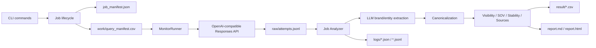
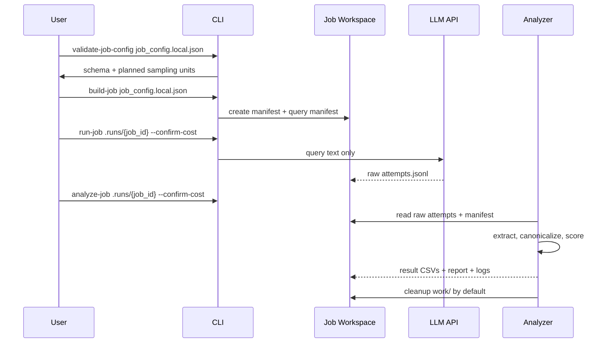
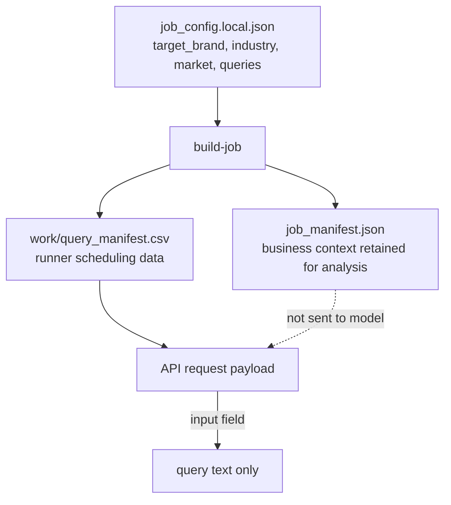
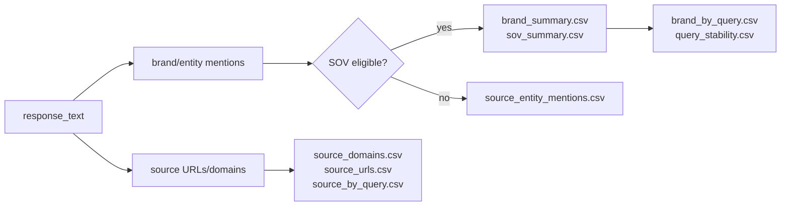

# GEO Brand Monitor

GEO Brand Monitor is a job-based CLI for measuring how brands appear in LLM answers.
It sends only user-like query text to an OpenAI-compatible Responses API, keeps raw
answer audit logs, extracts brand/entity mentions from the returned text, and produces
brand visibility, SOV, source, and stability reports.

The project is intentionally neutral:

- no bundled brand, industry, or query sample data;
- no provider-specific client naming or default model binding;
- no prebuilt competitor alias list;
- task data lives in local runtime bundles, not in repository source files.

## What It Measures

- Brand visibility across repeated LLM answers.
- Share of Voice (SOV) by response-level and mention-event-level signals.
- Recommended/ranked/sentiment signals when the answer structure exposes them.
- Query-level brand set stability across repeated samples.
- Source URL/domain co-occurrence returned by the model response.
- Data quality issues such as bad raw lines, partial samples, duplicated units, or
  job contract mismatches.

It does **not** claim market share, factual correctness, or native app ranking. It is an
API-based monitoring and audit framework.

## Architecture



## Job Lifecycle



## Data Contract

The task config stores business context. The runtime prompt does not.



The live request payload is deliberately narrow:

```json
{
  "model": "<MODEL_OR_ENDPOINT_ID>",
  "input": "<QUERY_TEXT>",
  "tools": [{"type": "web_search", "limit": 5}],
  "max_tool_calls": 2
}
```

It does not include `target_brand`, `industry`, `market`, or competitor names.

## Repository Layout

```text
src/geo_monitor/
  cli.py                 # public CLI commands
  config.py              # runtime settings and workspace root
  llm_client.py          # OpenAI-compatible Responses API client
  job.py                 # build/run/cleanup job lifecycle
  runner.py              # repeated sampling, resume, concurrency
  job_analysis.py        # extraction, metrics, reports, aggregates
  brand_extraction.py    # LLM extraction schema and canonicalization helpers
  response_parser.py     # response text/source parsing
  exporters.py           # JSONL/CSV utilities
  reporting.py           # Markdown/HTML/PDF helpers

data/
  job_config.schema.json # public config contract only

tests/
  fixtures/              # neutral test fixtures
```

## Runtime Workspace

Each run creates a local job bundle:

```text
.runs/{job_id}/
  job_manifest.json
  work/
    query_manifest.csv
    brand_mentions_raw.jsonl
    brand_canonical_map_work.json
  raw/
    attempts.jsonl
  logs/
    run_summary.json
    analysis_summary.json
    data_quality.json
    extraction_errors.jsonl
    raw_read_errors.jsonl
    cleanup_summary.json
  result/
    discovered_brands.csv
    brand_mentions_extracted.csv
    brand_canonical_map.csv
    brand_summary.csv
    sov_summary.csv
    brand_by_query.csv
    query_stability.csv
    source_entity_mentions.csv
    source_domains.csv
    source_urls.csv
    source_by_query.csv
    report.md
    report.html
```

`work/` is temporary and is cleaned after analysis unless `--keep-work` is passed.
`raw/`, `logs/`, `result/`, and `job_manifest.json` are retained for audit.

## Metric Model



Important definitions:

- **Mention rate**: responses mentioning a brand / successful responses.
- **SOV response share**: responses mentioning a brand / all brand response hits.
- **SOV event share**: eligible brand mention events / all eligible brand mention events.
- **Query coverage**: queries where a brand appeared / planned query count.
- **Stability**: repeated-answer similarity for brand sets and source-domain sets.

## Quick Start

```bash
python3 -m venv .venv
source .venv/bin/activate
pip install -e ".[dev]"
cp .env.example .env
```

Fill `.env` with your provider credentials:

```bash
LLM_API_KEY=
LLM_BASE_URL=https://api.example.com/v1
LLM_MODEL=provider-model
WEB_SEARCH_LIMIT=5
MAX_TOOL_CALLS=2
REQUEST_TIMEOUT_SECONDS=90
RETRY_MAX_ATTEMPTS=3
CONCURRENCY=1
```

Create a local config file such as `job_config.local.json`:

```json
{
  "target_brand": "<TARGET_BRAND>",
  "target_aliases": ["<OPTIONAL_TARGET_ALIAS>"],
  "industry": "<INDUSTRY>",
  "market": "<OPTIONAL_MARKET>",
  "queries": ["<QUERY_TEXT>"],
  "repeats": 20,
  "model": "<MODEL_OR_ENDPOINT_ID>",
  "web_search_limit": 5,
  "concurrency": 4,
  "start_interval_seconds": 0
}
```

Run the lifecycle:

```bash
geo-monitor validate-job-config job_config.local.json
geo-monitor build-job job_config.local.json
geo-monitor run-job .runs/{job_id} --confirm-cost
geo-monitor analyze-job .runs/{job_id} --confirm-cost
```

Use mock mode for a no-cost pipeline smoke test:

```bash
geo-monitor run-job .runs/{job_id} --mock
geo-monitor analyze-job .runs/{job_id} --include-mock
```

## Public CLI Surface

```text
doctor
validate-job-config
build-job
run-job
analyze-job
cleanup-job
export-csv
```

Cost-producing live calls require explicit `--confirm-cost`.

## Design Decisions

- **Job bundles over fixed project data**: real task inputs and generated artifacts stay
  in `.runs/{job_id}` or ignored local files.
- **Human-like prompt boundary**: the model receives only the query text.
- **Open discovery over competitor lists**: brands are extracted from raw answers, so new
  industries do not need prebuilt competitor aliases.
- **Hash-based resume**: completed samples are reused only when request parameters match.
- **Audit-first output**: raw attempts, quality logs, CSVs, and reports are all retained.
- **Provider-neutral API layer**: the client targets OpenAI-compatible Responses APIs.

## Development

```bash
python -m pytest
```

The repository intentionally excludes `.env`, `.runs/`, `.venv/`, cache directories, and
local task data.
