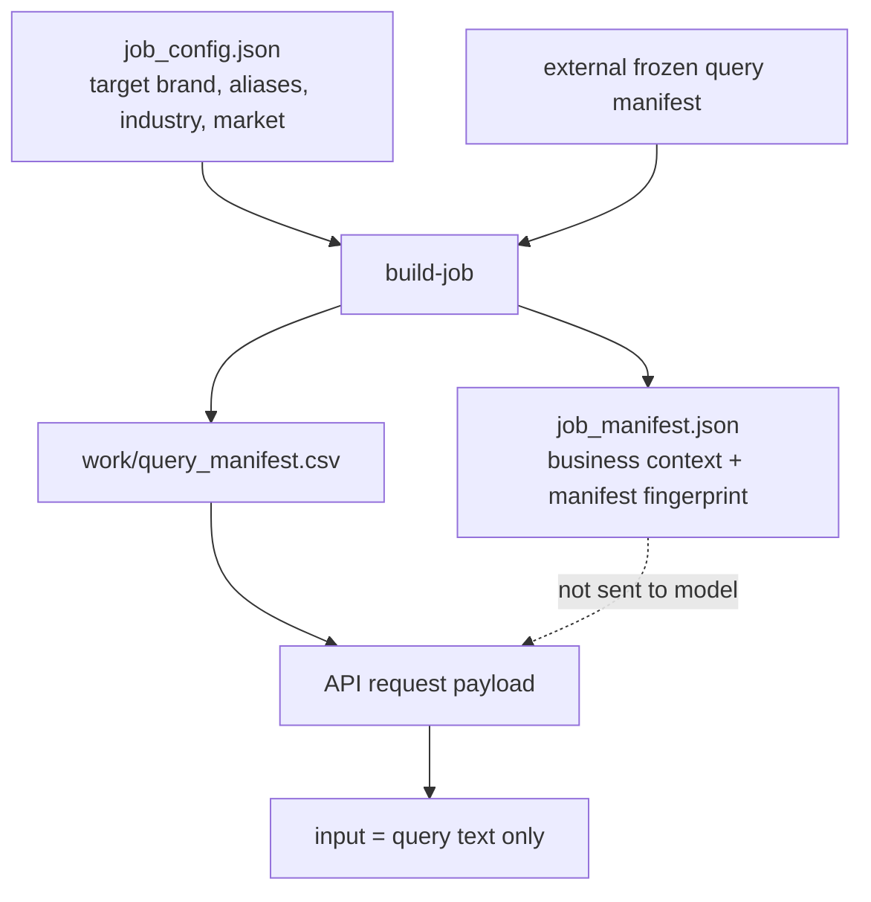
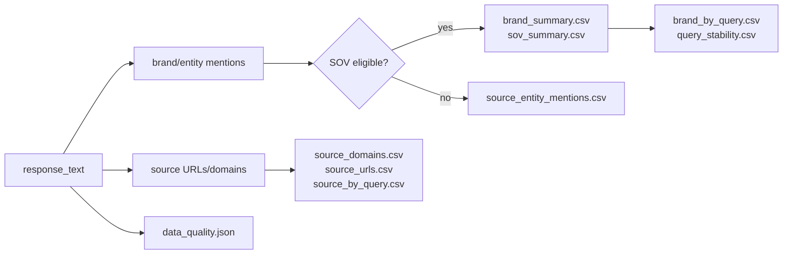

# GEO Brand Monitor

[English](README.md) | [简体中文](README.zh-CN.md)

GEO Brand Monitor is a lightweight, audit-first GEO analysis engine for sampling
LLM answers, measuring brand visibility, and generating reproducible local
reports.

It is designed as an engine, CLI, Python package, and agent/tool building block.
It is **not** a GEO SaaS product, not a scheduler, and not a data warehouse. The
repository contains reusable engine code only; business queries, brand data, raw
runs, DuckDB files, and dashboards belong in a user-owned external study
workspace.

## Project Status

Early engine. The core workflow is usable locally:

- persona fan-out to frozen query manifests;
- job-based sampling with raw JSONL audit logs;
- brand/entity extraction and canonicalization;
- visibility, SOV, recommendation, rank, sentiment, source, and stability CSVs;
- rebuildable DuckDB analysis cache;
- static local dashboard;
- embeddable Python API for Plugin / Skill / Agent workflows.

Licensed under the MIT License. See [LICENSE](LICENSE).

## What It Does

GEO Brand Monitor helps answer:

- Does the target brand appear in AI answers?
- How often does it appear across repeated samples?
- Which other brands or entities appear with it?
- Is it merely mentioned, or also recommended, ranked, or described positively?
- Which queries, personas, and source domains drive the results?
- Are the samples complete and trustworthy enough to interpret?

It does **not** claim market share, factual correctness, native app ranking, or
SEO performance. It measures responses produced by an OpenAI-compatible
Responses API under a controlled query manifest.

## Core Features

- **CLI-first workflow**: build, run, analyze, export, query, and dashboard from
  local commands.
- **External study workspace**: long-running study data stays outside the
  project repository.
- **Persona fan-out**: turn seed prompts into deterministic query variants.
- **Frozen query manifests**: stable inputs for reproducible repeated runs.
- **Job workspaces**: each run is an auditable execution bundle.
- **Raw audit logs**: every attempt is retained as JSONL with `query` and
  `query_meta`.
- **Brand extraction**: discover brands/entities from answers without a bundled
  competitor list.
- **Metrics and reports**: CSV, Markdown, HTML, and best-effort optional PDF outputs.
- **DuckDB analysis layer**: rebuildable local cache for cross-run analysis.
- **Static dashboard**: local HTML dashboard without a backend service.
- **Python API**: structured result object for external agents and workflows.

## Architecture

```mermaid
flowchart LR
    Study["External study workspace"] --> Seeds["seed_prompts.yaml"]
    Seeds --> Fanout["Persona fan-out"]
    Fanout --> Frozen["manifests/query_manifest.v1.csv"]

    Config["job_config.json"] --> Build["build-job"]
    Frozen --> Build
    Build --> Job["job workspace<br/>runs/{job_id}"]
    Job --> Work["work/query_manifest.csv<br/>temporary runner input"]

    Work --> Runner["sampling runner"]
    Runner --> API["OpenAI-compatible<br/>Responses API"]
    API --> Raw["raw/attempts.jsonl<br/>query + query_meta snapshot"]

    Raw --> Analyze["analyze-job"]
    Analyze --> Extract["brand/entity extraction"]
    Extract --> Metrics["visibility / SOV / sources / quality"]
    Metrics --> CSV["result/*.csv"]
    Metrics --> Report["report.md / report.html"]
    Metrics --> Logs["logs/*.json / *.jsonl"]

    Raw --> DuckDB["geo.duckdb<br/>external analysis cache"]
    CSV --> DuckDB
    DuckDB --> Dashboard["static dashboard"]
    DuckDB --> API2["Python API / agent tools"]
```



## Workspace Model

Keep the engine, single-run artifacts, and long-running study data separate.

```text
geo-monitor project
  engine / CLI / package / skill code
  no business data or long-running study state

job workspace
  one execution bundle under a runs directory
  work/query_manifest.csv is temporary runner input
  raw/, logs/, result/, job_manifest.json are retained audit artifacts

study workspace
  seed_prompts.yaml
  manifests/query_manifest.v1.csv
  runs/{job_id}/...
  geo.duckdb
  dashboard/
```

`work/query_manifest.csv` may be deleted after execution. Long-term analysis is
reconstructed from `raw/attempts.jsonl`, where each new attempt includes the
actual query text and a `query_meta` snapshot containing dimensions such as
`seed_id`, `persona`, `intent`, `template_id`, `variant_id`, `locked_at`, and
custom manifest metadata preserved in `query_metadata_json`.

For real studies, prefer a directory outside the repository. The repository also
ignores common local study outputs such as `my-geo-study/`, `study/`, and
`*.duckdb`.

## Data Boundary

The model receives only user-like query text. Job-level business context is kept
for analysis, not sent to the model.



Example live request shape:

```json
{
  "model": "<MODEL_OR_ENDPOINT_ID>",
  "input": "<QUERY_TEXT>",
  "tools": [{"type": "web_search", "limit": 5}],
  "max_tool_calls": 2
}
```

The request does not include `target_brand`, `industry`, `market`, or competitor
names.

`raw/attempts.jsonl` is sensitive local audit data. It may contain raw model
outputs, citation snippets, source URLs, provider metadata, business query text,
and brand/project context embedded in prompts or responses. Keep study
workspaces in user-controlled paths with appropriate filesystem permissions;
shared job bundles may need redaction. The project stays audit-first and keeps
raw attempts by default.

## Quick Start: Local Mock Run

This smoke test does not call an external API.

```bash
python3 -m venv .venv
source .venv/bin/activate
pip install -e ".[dev]"

STUDY_DIR=/tmp/geo-monitor-study
RUNS_DIR="$STUDY_DIR/runs"
MANIFEST="$STUDY_DIR/manifests/query_manifest.v1.csv"
DB="$STUDY_DIR/geo.duckdb"
DASHBOARD="$STUDY_DIR/dashboard"

mkdir -p "$STUDY_DIR/manifests" "$RUNS_DIR"

geo-monitor fanout \
  --input examples/seed_prompts.example.yaml \
  --output "$MANIFEST"

geo-monitor validate-job-config examples/job_config.example.json \
  --query-manifest "$MANIFEST"

geo-monitor build-job examples/job_config.example.json \
  --query-manifest "$MANIFEST" \
  --runs-dir "$RUNS_DIR"

JOB_DIR=$(find "$RUNS_DIR" -maxdepth 1 -mindepth 1 -type d | head -n 1)

geo-monitor run-job "$JOB_DIR" --mock
geo-monitor analyze-job "$JOB_DIR" --include-mock

geo-monitor db build --runs "$RUNS_DIR" --output "$DB"
geo-monitor dashboard build --db "$DB" --out "$DASHBOARD"
```

Open:

```text
/tmp/geo-monitor-study/dashboard/index.html
```

## Live API Configuration

Configure an OpenAI-compatible Responses API provider through environment
variables, or opt in to an explicit env file. The CLI no longer trusts a `.env`
file from the current working directory by default.

```bash
cp .env.example /tmp/geo-monitor.env
export GEO_MONITOR_ENV_FILE=/tmp/geo-monitor.env
```

```bash
LLM_API_KEY=
LLM_BASE_URL=https://api.example.com/v1
LLM_MODEL=provider-model
WEB_SEARCH_LIMIT=5
MAX_TOOL_CALLS=2
REQUEST_TIMEOUT_SECONDS=90
RETRY_MAX_ATTEMPTS=3
CONCURRENCY=1
```

`https://api.example.com/v1` is a placeholder endpoint. Live commands refuse to
run until `LLM_BASE_URL` points at a real `http(s)` endpoint and `LLM_API_KEY` is
configured. Run `geo-monitor doctor` to inspect the active endpoint, API key
status, and env-file source.

Live sampling and live LLM extraction may incur provider costs. Commands that
can produce live costs require explicit `--confirm-cost`.

```bash
geo-monitor run-job "$JOB_DIR" --confirm-cost
geo-monitor analyze-job "$JOB_DIR" --confirm-cost
```

## Persona Fan-out

Seed prompts describe stable business intents. Fan-out creates deterministic
query variants by persona.

```yaml
seeds:
  - seed_id: sample_beginner
    category: sample_category
    intent: product_recommendation
    seed_query: "推荐一款适合新手的示例产品"
    language: zh-CN
    personas:
      - budget_sensitive
      - quality_oriented
      - comparison_shopper
      - beginner
      - convenience_first
```

Generate a frozen external manifest:

```bash
geo-monitor fanout \
  --input ./study/seed_prompts.yaml \
  --output ./study/manifests/query_manifest.v1.csv
```

Fan-out output is byte-stable for the same input and version. It uses fixed CSV
columns:

```text
query_id, variant_id, seed_id, seed_query, category, intent, persona,
template_id, query, language, generation_method, fanout_version,
manifest_version, locked_at
```

## Outputs

Each job workspace contains:

```text
runs/{job_id}/
  job_manifest.json
  work/
    query_manifest.csv
    brand_mentions_raw.jsonl
    brand_canonical_map_work.json
  raw/
    attempts.jsonl
  logs/
    run_summary.json
    analysis_summary.json
    data_quality.json
    extraction_errors.jsonl
    raw_read_errors.jsonl
    cleanup_summary.json
  result/
    discovered_brands.csv
    brand_mentions_extracted.csv
    brand_canonical_map.csv
    brand_summary.csv
    sov_summary.csv
    brand_by_query.csv
    query_stability.csv
    source_entity_mentions.csv
    source_domains.csv
    source_urls.csv
    source_by_query.csv
    report.md
    report.html
    report.pdf              # optional, best-effort
```

`work/` is temporary. `raw/`, `logs/`, `result/`, and `job_manifest.json` are
retained for audit. `analyze-job` removes `work/` by default after analysis;
use `--keep-work` when debugging intermediate extraction files.

When analysis writes study-level aggregates, the runs directory also contains:

```text
runs/index.jsonl
runs/aggregate/brand_trends.csv
runs/aggregate/target_brand_trends.csv
```

These files are compact cross-run study summaries. They are useful long-term
study state, but they can be rebuilt from retained job bundles. Embedded or
single-bundle workflows can use `analyze-job --no-aggregate` or
`run_geo_monitor(..., write_aggregates=False)`.

## Metrics



See [docs/metrics.md](docs/metrics.md) for metric denominators, grain, mock/live
rules, partial-sample caveats, and currently overlapping SOV fields.

Current metrics include:

- **Mention rate**: responses mentioning a brand / successful responses.
- **SOV response share**: responses mentioning a brand / all brand response hits.
- **SOV event share**: eligible brand mention events / all eligible events.
- **Query coverage**: queries where a brand appeared / planned query count.
- **Recommendation rates**: recommendation signals over mentions and samples.
- **Rank signals**: observed ranks, average rank, and top-3 presence.
- **Sentiment signals**: positive, neutral, negative, and unknown rates.
- **Stability**: repeated-answer similarity for brand sets.
- **Source coverage**: source domain and URL occurrence / coverage.
- **Data quality**: partial samples, malformed raw lines, duplicate units,
  contract mismatches, and extraction errors.

## DuckDB And Dashboard

DuckDB is a rebuildable analysis cache. It does not replace raw JSONL.

```bash
geo-monitor db build --runs ./study/runs --output ./study/geo.duckdb
geo-monitor db inspect --db ./study/geo.duckdb
geo-monitor db query --db ./study/geo.duckdb \
  "select seed_id, persona, count(*) from queries group by 1,2"
```

`db query` is a restricted local read-only analysis helper. It rejects multi-
statement SQL, write/admin statements, and DuckDB external file-reading
functions. Advanced admin SQL should be run with DuckDB's own tools by trusted
operators. Agent-facing or embedded workflows should prefer typed Python API
results instead of raw SQL.

Build a static dashboard:

```bash
geo-monitor dashboard build \
  --db ./study/geo.duckdb \
  --out ./study/dashboard
```

The dashboard is static HTML. It does not require a backend service, login,
React/Vue app, or hosted database.

## Python API

```python
from geo_monitor import run_geo_monitor

result = run_geo_monitor(
    config_path="examples/job_config.example.json",
    study_dir="./study",
    query_manifest_path="./study/manifests/query_manifest.v1.csv",
    mock=True,
    build_db=True,
    build_dashboard=False,
)

print(result.summary_markdown)
print(result.metrics)
print(result.artifact_paths)
```

High-level API calls require either `study_dir` or `runs_dir`. Explicit paths
win. `query_manifest_path` is never guessed from a study directory.
`geo_monitor.api` is the canonical implementation module; `geo_monitor` re-
exports it for convenience. `geo_monitor.tool` remains available only as a
backward-compatible import shim.

Installed wheels include packaged copies of the job config schema, examples,
metrics reference, and Simplified Chinese README under `geo_monitor/data`,
`geo_monitor/examples`, and `geo_monitor/docs`. Source checkouts can keep using
the top-level `data/`, `examples/`, and `docs/` paths shown above.

## CLI Reference

```text
doctor
validate-job-config
fanout
build-job
run-job
analyze-job
cleanup-job
export-csv
db build / db inspect / db query
dashboard build
```

## Repository Layout

```text
src/geo_monitor/
  cli.py                 # public CLI commands
  config.py              # runtime settings and workspace root
  dataset.py             # query manifest loading
  fanout.py              # seed prompt -> persona query manifest
  job.py                 # build/run/cleanup job lifecycle
  runner.py              # repeated sampling, resume, concurrency
  analysis/              # extraction pipeline, metrics, reports, aggregates
  job_analysis.py        # compatibility facade for analysis imports
  brand_extraction.py    # LLM extraction schema and canonicalization
  response_parser.py     # response text/source parsing
  exporters.py           # JSONL/CSV utilities
  reporting.py           # Markdown/HTML/PDF helpers
  db.py                  # DuckDB analysis cache
  dashboard.py           # static HTML dashboard
  api.py                 # stable public Python API implementation
  tool.py                # backward-compatible API import shim

data/
  job_config.schema.json

examples/
  job_config.example.json
  seed_prompts.example.yaml

tests/
  fixtures/
```

## Design Principles

- **Lightweight**: local files, CLI commands, and small modules.
- **Audit-first**: raw attempts and quality logs remain the source of truth.
- **Engine-first**: no user system, hosted SaaS dashboard, or scheduler.
- **Provider-neutral**: targets OpenAI-compatible Responses APIs.
- **Study workspace boundary**: long-running business data stays outside the
  project repository.
- **Human-like prompt boundary**: the model receives only the query text.
- **Open discovery**: competitors are discovered from answers instead of a
  bundled alias list.

## Development

```bash
python -m pytest
```

The repository intentionally excludes `.env`, `.runs/`, `.venv/`, local study
workspaces, DuckDB files, cache directories, and generated task data.

## License

MIT. See [LICENSE](LICENSE).
