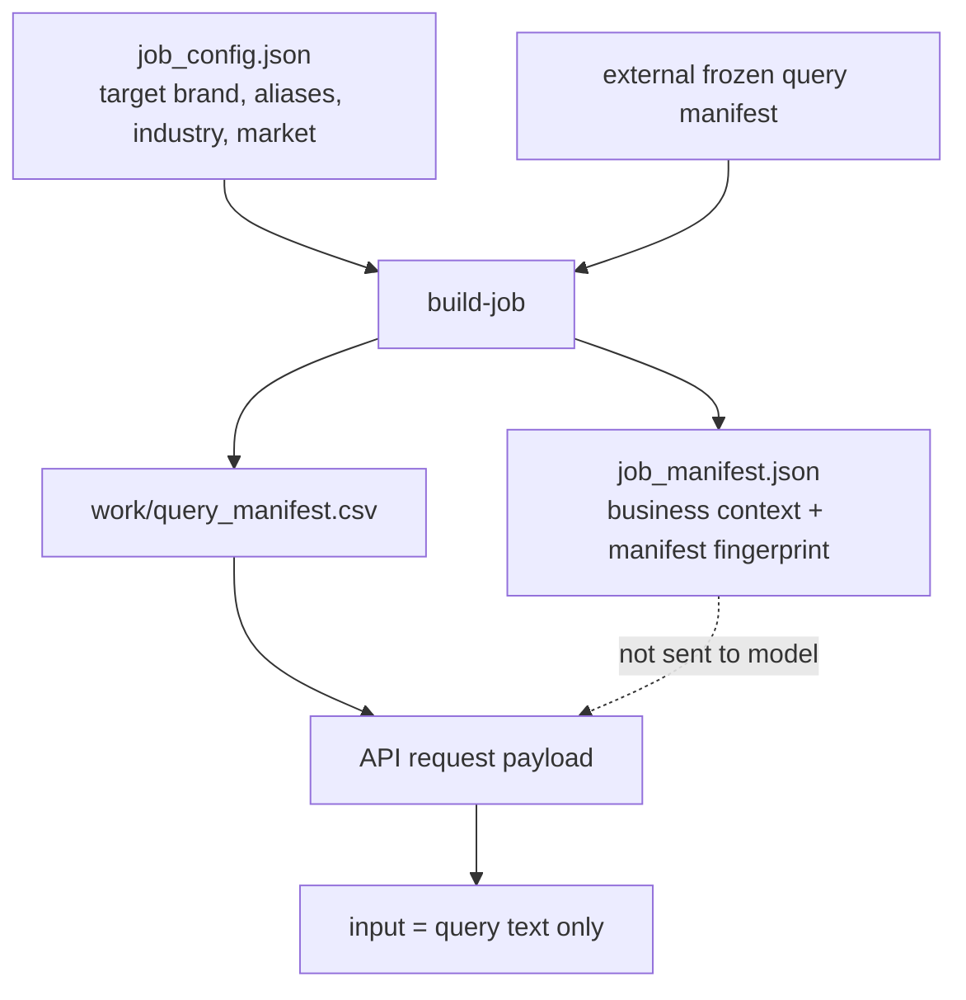
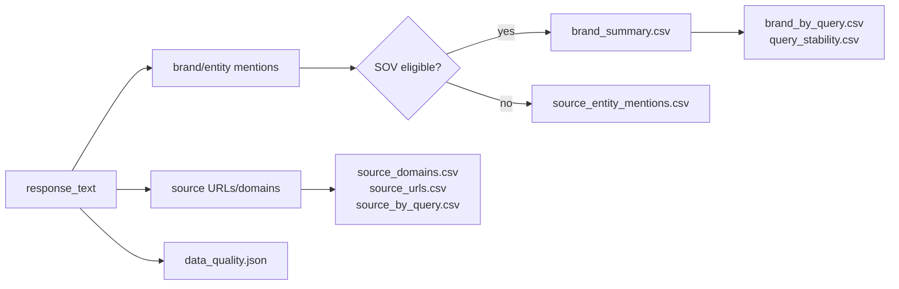

# GEO Brand Monitor

[English](README.md) | [简体中文](README.zh-CN.md)

GEO Brand Monitor is a lightweight, audit-first GEO analysis engine for sampling
LLM answers, measuring brand visibility, and generating reproducible local
reports.

It is designed as an engine, CLI, Python package, and agent/tool building block.
It is **not** a GEO SaaS product, not a scheduler, and not a data warehouse. The
repository contains reusable engine code only; business queries, brand data, raw
runs and optional DuckDB artifacts belong in a user-owned external
study workspace.

## Project Status

Version 0.3 is a stabilized local engine with a report-first core and explicit
provider SDK boundaries:

- persona fan-out to frozen query manifests;
- job-based sampling with raw JSONL audit logs;
- brand/entity extraction and canonicalization;
- visibility, SOV, recommendation, rank, sentiment, source, and stability CSVs;
- an explainable intelligence layer for overview, competitor, citation,
  situation, perception, trends, and rule-based opportunities;
- Markdown and PDF reports rendered from one versioned report model;
- optional rebuildable DuckDB cache and ReportModel-derived static HTML;
- embeddable Python API for Plugin / Skill / Agent workflows.

Licensed under the MIT License. See [LICENSE](LICENSE).

### Migrating From 0.1

- Import the high-level API from `geo_monitor`, not the removed
  `geo_monitor.tool` compatibility path.
- Import advanced analysis entry points from `geo_monitor.analysis`, not
  `geo_monitor.job_analysis` or the removed pipeline module.
- Replace `build_dashboard=True` with `report_formats=("markdown", "pdf",
  "html")` or CLI `--html-report`.
- Build DuckDB explicitly through `geo-monitor db build` after installing
  `geo-monitor[duckdb]`; it is no longer part of `run_geo_monitor`.
- Pass either `--runs-dir` or `--out-dir` to `build-job`; 0.2 no longer writes
  an implicit repository-local `.runs` workspace.
- Use the canonical `brand_summary.csv` contract. Duplicate
  `discovered_brands.csv` / `sov_summary.csv` outputs and synonymous metric
  aliases were removed; re-analysis also deletes those stale files.
- Wheel installs no longer contain duplicated source docs/examples. Use the
  repository or sdist for those files.

Legacy `geo-job-v1`/`v2` manifests that do not freeze a removed adapter identity
are normalized on read, and legacy request hashes remain available for safe
resume matching. Bundles that explicitly freeze a removed adapter name fail
closed; create a new 0.3 job instead of silently changing their SDK transport.

Version 0.3 adapter names are intentionally explicit about both provider and
API family. See [Provider and adapter contract](docs/providers.md) for native
Ark/DashScope providers, the DeepSeek boundary, and the adapter-name migration.

## What It Does

GEO Brand Monitor helps answer:

- Does the target brand appear in AI answers?
- How often does it appear across repeated samples?
- Which other brands or entities appear with it?
- Is it merely mentioned, or also recommended, ranked, or described positively?
- Which queries, personas, and source domains drive the results?
- Are the samples complete and trustworthy enough to interpret?

It does **not** claim market share, factual correctness, native app ranking, or
SEO performance. It measures responses produced by supported provider APIs
under a controlled query manifest.

## Core Features

- **Report-first workflow**: build, run, and analyze locally into Markdown and
  PDF reports without requiring a database or web application.
- **External study workspace**: long-running study data stays outside the
  project repository.
- **Persona fan-out**: turn seed prompts into deterministic query variants.
- **Frozen query manifests**: stable inputs for reproducible repeated runs.
- **Job workspaces**: each run is an auditable execution bundle.
- **Raw audit logs**: every attempt is retained as JSONL with `query` and
  `query_meta`.
- **Brand extraction**: discover brands/entities from answers without a bundled
  competitor list.
- **Metrics and reports**: CSV plus deterministic Markdown and PDF outputs from
  the same versioned semantic model.
- **Explainable intelligence**: five independent overview scores, explicit
  denominators/N-A semantics, macro-by-query segments, and traceable gap tables.
- **Optional analysis extensions**: DuckDB, cross-run aggregates, and
  ReportModel-derived HTML are opt-in and remain outside the core path.
- **Python API**: structured result object for external agents and workflows.

## Architecture

```mermaid
flowchart LR
    Study["External study workspace"] --> Seeds["seed_prompts.yaml"]
    Seeds --> Fanout["Persona fan-out"]
    Fanout --> Frozen["manifests/query_manifest.v1.csv"]

    Config["job_config.json"] --> Build["build-job"]
    Frozen --> Build
    Build --> Job["job workspace<br/>runs/{job_id}"]
    Job --> Work["work/query_manifest.csv<br/>temporary runner input"]

    Work --> Runner["sampling runner"]
    Runner --> API["Provider SDK<br/>API"]
    API --> Raw["raw/attempts.jsonl<br/>query + query_meta snapshot"]

    Raw --> Analyze["analyze-job"]
    Analyze --> Extract["brand/entity extraction"]
    Extract --> Metrics["visibility / SOV / sources / quality"]
    Metrics --> CSV["result/*.csv"]
    Metrics --> Model["report.json<br/>versioned ReportModel"]
    Model --> Report["report.md / report.pdf"]
    Model -. "optional" .-> HTML["report.html"]
    Metrics --> Logs["logs/*.json / *.jsonl"]

    Raw -. "optional" .-> DuckDB["geo.duckdb<br/>external analysis cache"]
    CSV -. "optional" .-> DuckDB
    DuckDB -.-> DBAPI["explicit SQL / Python analysis"]
    Report --> API2["people / Python API / agent tools"]
```



## Workspace Model

Keep the engine, single-run artifacts, and long-running study data separate.

```text
geo-monitor project
  engine / CLI / package / skill code
  no business data or long-running study state

job workspace
  one execution bundle under a runs directory
  work/query_manifest.csv is temporary runner input
  raw/, logs/, result/, job_manifest.json are retained audit artifacts

study workspace
  seed_prompts.yaml
  manifests/query_manifest.v1.csv
  runs/{job_id}/...
  geo.duckdb             # optional
```

`work/query_manifest.csv` may be deleted after execution. Long-term analysis is
reconstructed from `raw/attempts.jsonl`, where each new attempt includes the
actual query text and a `query_meta` snapshot containing dimensions such as
`seed_id`, `persona`, `intent`, `template_id`, `variant_id`, `locked_at`, and
custom manifest metadata preserved in `query_metadata_json`.

A job is a single-adapter experiment. A cross-provider study is a set of sibling
jobs over the same frozen `query_manifest.csv`; comparison strength is computed
later in DuckDB cohorts using provider, adapter, API family, sampling
fingerprint, and analysis fingerprint.

For real studies, prefer a directory outside the repository. The repository also
ignores common local study outputs such as `my-geo-study/`, `study/`, and
`*.duckdb`. There is intentionally no repository-root `outputs/` placeholder; if
one appears locally, treat it as scratch data and move real studies into an
external workspace.

## Data Boundary

The model receives only user-like query text. Job-level business context is kept
for analysis, not sent to the model.



Example live request shape:

```json
{
  "model": "<MODEL_OR_ENDPOINT_ID>",
  "input": "<QUERY_TEXT>",
  "tools": [{"type": "web_search"}],
  "tool_choice": "required",
  "max_tool_calls": 2
}
```

Provider-specific optional fields such as `include` are sent only when they are
explicitly configured and validated for that endpoint.

The request does not include `target_brand`, `industry`, `market`, or competitor
names.

`raw/attempts.jsonl` is sensitive local audit data. It may contain raw model
outputs, citation snippets, source URLs, provider metadata, business query text,
and brand/project context embedded in prompts or responses. Keep study
workspaces in user-controlled paths with appropriate filesystem permissions;
shared job bundles may need redaction. The project stays audit-first and keeps
raw attempts by default.

## Quick Start: Local Mock Run

This smoke test does not call an external API.

```bash
python3 -m venv .venv
source .venv/bin/activate
pip install -e ".[dev]"

STUDY_DIR=/tmp/geo-monitor-study
RUNS_DIR="$STUDY_DIR/runs"
MANIFEST="$STUDY_DIR/manifests/query_manifest.v1.csv"
mkdir -p "$STUDY_DIR/manifests" "$RUNS_DIR"

geo-monitor fanout \
  --input examples/seed_prompts.example.yaml \
  --output "$MANIFEST"

geo-monitor validate-job-config examples/job_config.example.json \
  --query-manifest "$MANIFEST"

geo-monitor build-job examples/job_config.example.json \
  --query-manifest "$MANIFEST" \
  --runs-dir "$RUNS_DIR"

JOB_DIR=$(find "$RUNS_DIR" -maxdepth 1 -mindepth 1 -type d | head -n 1)

geo-monitor run-job "$JOB_DIR" --mock
geo-monitor analyze-job "$JOB_DIR" --include-mock
```

The primary outputs are:

```text
/tmp/geo-monitor-study/runs/{job_id}/result/report.md
/tmp/geo-monitor-study/runs/{job_id}/result/report.pdf
```

Add `--html-report` only when a temporary self-contained HTML report is useful.
DuckDB is an optional extension described below and is not created by the
default workflow.

## Live API Configuration

Configure provider APIs through environment variables, or opt in to an explicit
env file. The CLI does not trust a `.env` file from the current working
directory by default. The generic adapter uses `openai`; Doubao uses the
official Ark runtime SDK, and Qwen uses the official DashScope SDK.

```bash
cp .env.example /tmp/geo-monitor.env
export GEO_MONITOR_ENV_FILE=/tmp/geo-monitor.env
```

```bash
LLM_API_KEY=
LLM_BASE_URL=https://api.example.com/v1
LLM_MODEL=provider-model
ARK_API_KEY=
DASHSCOPE_API_KEY=
DEEPSEEK_API_KEY=
WEB_SEARCH_LIMIT=5
MAX_TOOL_CALLS=2
MAX_OUTPUT_TOKENS=2000
ANALYSIS_MAX_OUTPUT_TOKENS=4000
REQUEST_TIMEOUT_SECONDS=90
RETRY_MAX_ATTEMPTS=3
CONCURRENCY=1
MAX_JOB_UNITS=10000
MAX_CONSECUTIVE_ERRORS=5
MAX_ERROR_RATE=0.5
```

`https://api.example.com/v1` is a placeholder for the generic provider.
Native providers use their official endpoints by default, independently of
which key variable supplies the credential. They may be overridden only with
`ARK_BASE_URL`, `DASHSCOPE_BASE_URL`, or `DEEPSEEK_BASE_URL`.
Native overrides must remain on the provider's official HTTPS domains; use the
generic adapter for a proxy or custom host.
Run `geo-monitor doctor` to inspect the redacted configuration.

For Doubao Ark, use key/model placeholders rather than putting secrets in a
config file:

```bash
pip install -e '.[doubao]'
export ARK_API_KEY='<ARK_API_KEY>'
```

Select one adapter in the job config:

```json
{
  "model": "<ARK_MODEL_OR_ENDPOINT_ID>",
  "adapter": "doubao_ark_responses_web_search",
  "analysis_model": "<ARK_MODEL_OR_ENDPOINT_ID>",
  "analysis_adapter": "doubao_ark_responses_text"
}
```

The native Ark adapter sends `WEB_SEARCH_LIMIT` and records
`web_search_limit_effective=true`; other adapters record `false` because they
have no equivalent result-count control. Effective request conditions are
frozen into audit and comparability fingerprints.

Live sampling and live LLM extraction may incur provider costs. Commands that
can produce live costs require explicit `--confirm-cost`.

```bash
geo-monitor run-job "$JOB_DIR" --confirm-cost
geo-monitor analyze-job "$JOB_DIR" --confirm-cost
```

The SDK's own retries are disabled. The application retries only transient
transport/rate-limit/5xx failures, then stops a live run when its consecutive-
error or sampled error-rate circuit threshold is reached. Resume uses the latest
terminal attempt: a newer error/interruption supersedes an older success and is
retried. `run_execution_id`, `run_generation`, `diagnostic_generation`,
`logical_unit_id`, and unique `attempt_id` keep physical executions distinct;
dry/mock diagnostics do not invalidate an analyzed live generation.

See [docs/providers.md](docs/providers.md) for adapter options, effective versus
compatibility settings, retry/circuit behavior, endpoint safety, and the full
resume identity contract.

## Persona Fan-out

Seed prompts describe stable business intents. Fan-out creates deterministic
query variants by persona.

```yaml
seeds:
  - seed_id: sample_beginner
    category: sample_category
    intent: product_recommendation
    seed_query: "推荐一款适合新手的示例产品"
    language: zh-CN
    personas:
      - budget_sensitive
      - quality_oriented
      - comparison_shopper
      - beginner
      - convenience_first
```

Generate a frozen external manifest:

```bash
geo-monitor fanout \
  --input ./study/seed_prompts.yaml \
  --output ./study/manifests/query_manifest.v1.csv
```

Fan-out output is byte-stable for the same input and version. Without an external
registry it uses the built-in persona templates and fixed CSV columns:

```text
query_id, variant_id, seed_id, seed_query, category, intent, persona,
template_id, query, language, generation_method, fanout_version,
manifest_version, locked_at
```

Advanced studies can opt in to an external persona template registry when
industry-, language-, or market-specific query wording should be controlled
outside source code:

```yaml
schema_version: persona-template-registry-v1
registry_id: default_zh_cn
registry_version: v1
personas:
  beginner:
    template_id: beginner_help
    template: "我是新手，{seed_query}"
fallback:
  template_id: default
  template: "{seed_query}"
```

```bash
geo-monitor fanout \
  --input ./study/seed_prompts.yaml \
  --output ./study/manifests/query_manifest.v1.csv \
  --persona-template-registry ./study/persona_templates.yaml
```

Registry mode is explicit and strict: every persona must exist in the registry or
be covered by an explicit `fallback`. Registry output appends audit columns
(`template_source`, `template_registry_id`, `template_registry_version`,
`template_registry_schema_version`, `template_registry_sha256`, `template_hash`).
Template text changes are included in the query id digest, so historical studies
should keep using their frozen manifest instead of regenerating old inputs.

Registry templates become model request text. Do not put target brands,
competitor lists, or sensitive business context into templates unless that is an
intentional experiment design.

## Job Workspace Artifacts

Each job workspace contains:

```text
runs/{job_id}/
  job_manifest.json
  work/
    query_manifest.csv
    brand_mentions_raw.jsonl
    brand_canonical_map_work.json
  raw/
    attempts.jsonl
  logs/
    run_summary.json
    analysis_summary.json
    data_quality.json
    extraction_errors.jsonl
    raw_read_errors.jsonl
    cleanup_summary.json
  result/
    brand_mentions_extracted.csv
    brand_canonical_map.csv
    brand_summary.csv
    brand_by_query.csv
    query_stability.csv
    source_entity_mentions.csv
    source_domains.csv
    source_urls.csv
    source_by_query.csv
    quality_summary.csv
    attempt_facts.csv
    query_facts.csv
    brand_attempt_facts.csv
    geo_overview_scores.csv
    visibility_summary.csv
    recommendations.csv
    recommendation_summary.csv
    recommendation_by_persona.csv
    competitor_edges.csv
    competitor_win_loss.csv
    competitor_replacements.csv
    rank_gap.csv
    source_types.csv
    brand_source_domains.csv
    brand_source_urls.csv
    source_gaps.csv
    visibility_by_seed.csv
    visibility_by_persona.csv
    visibility_by_intent.csv
    visibility_by_scenario.csv
    perception_claims.csv
    perception_strengths.csv
    perception_weaknesses.csv
    perception_pricing.csv
    perception_audience_fit.csv
    trend_deltas.csv
    trend_drift.csv
    trend_volatility.csv
    opportunity_query_gaps.csv
    opportunity_persona_gaps.csv
    opportunity_source_gaps.csv
    opportunity_messaging_gaps.csv
    report.json             # canonical, versioned semantic model
    report.md               # default human-readable report
    report.pdf              # default portable report
    report.html             # optional: --html-report
```

`work/` is temporary. `raw/`, `logs/`, `result/`, and `job_manifest.json` are
retained for audit. `analyze-job` removes `work/` by default after analysis;
use `--keep-work` when debugging intermediate extraction files.

When analysis is explicitly run with `--aggregate`, the runs directory also
contains:

```text
runs/index.jsonl
runs/aggregate/brand_trends.csv
runs/aggregate/target_brand_trends.csv
```

These files are compact cross-run study summaries and can be rebuilt from
retained job bundles. They are disabled by default to keep a single analysis
self-contained; use `run_geo_monitor(..., write_aggregates=True)` when needed.

## Metrics



See [docs/metrics.md](docs/metrics.md) for metric denominators, latest-terminal
attempt semantics, mock/live rules, partial-sample caveats, denominator facts,
and the response-grain meaning of `sov_response_share`.

Current metrics include:

- **Mention rate**: responses mentioning a brand / successful responses.
- **SOV response share**: responses mentioning a brand / all brand response hits.
- **Query coverage**: queries where a brand appeared / planned query count.
- **Recommendation rates**: recommendation signals over mentions and samples.
- **Rank signals**: observed ranks, average rank, and top-3 presence.
- **Sentiment signals**: positive, neutral, negative, and unknown rates.
- **Stability**: repeated-answer similarity for brand sets.
- **Source coverage**: source domain and URL occurrence / coverage.
- **Data quality**: partial samples, malformed raw lines, duplicate units,
  contract mismatches, and extraction errors.
- **Overview scores**: independent `0..100` visibility, recommendation,
  competitor, source, and quality scores with component breakdowns. Missing
  source evidence is N/A rather than zero.
- **Intelligence**: recommendation types, target/competitor win-loss and
  replacement risk, citation attribution/gaps, evidence-gated perception,
  run deltas/drift/volatility, and traceable rule-based opportunities.

Situation tables use equal-weight macro-by-query as their primary business
rate and retain micro-by-attempt as a diagnostic. Every intelligence family
carries its eligible/planned denominator and trace IDs. See
[docs/intelligence.md](docs/intelligence.md) for formulas, all stable CSV names,
eligibility gates, N/A rules, and interpretation limits.

## Optional DuckDB

DuckDB is an opt-in, rebuildable analysis cache. It does not replace raw JSONL
and is not required to generate reports.

Install the extension explicitly:

```bash
pip install "geo-monitor[duckdb]"
```

```bash
geo-monitor db build --runs ./study/runs --output ./study/geo.duckdb
geo-monitor db inspect --db ./study/geo.duckdb
geo-monitor db query --db ./study/geo.duckdb \
  "select seed_id, persona, count(*) from queries group by 1,2"
geo-monitor db query --db ./study/geo.duckdb \
  "select * from geo_overview_scores order by visibility_score desc nulls last"
```

`db query` is a restricted local read-only analysis helper. It rejects multi-
statement SQL, write/admin statements, and DuckDB external file-reading
functions. Advanced admin SQL should be run with DuckDB's own tools by trusted
operators. Agent-facing or embedded workflows should prefer typed Python API
results instead of raw SQL.

Current-generation intelligence CSVs are registered in
`intelligence_artifacts`, retained losslessly in `intelligence_rows`, and
exposed as read-only views named after each CSV stem (for example,
`geo_overview_scores`, `visibility_by_persona`, and `competitor_edges`). The DB
builder ignores stale or generation-mismatched analysis files.

Temporary HTML is generated directly from the same `ReportModel` as Markdown
and PDF via `analyze-job --html-report`; there is no separate dashboard stack.

## Python API

```python
from geo_monitor import run_geo_monitor

result = run_geo_monitor(
    config_path="examples/job_config.example.json",
    study_dir="./study",
    query_manifest_path="./study/manifests/query_manifest.v1.csv",
    mock=True,
)

print(result.summary_markdown)
print(result.metrics)
print(result.artifact_paths)
```

High-level API calls require either `study_dir` or `runs_dir`. Explicit paths
win. `query_manifest_path` is never guessed from a study directory.
`geo_monitor.api` is the canonical implementation module; `geo_monitor`
re-exports it for convenience. Removed 0.1 compatibility import paths are not
part of the current API.

Schemas, examples, and reference documents have one source of truth in the
top-level `data/`, `examples/`, and `docs/` directories and are included in the
source distribution. Wheels contain runtime code only.

## CLI Reference

```text
doctor
validate-job-config
fanout
build-job
run-job
analyze-job
cleanup-job
export-csv
db build / db inspect / db query
```

## Repository Layout

```text
src/geo_monitor/
  cli.py                 # public CLI commands
  api.py                 # stable public Python API
  config.py              # runtime settings and workspace root
  dataset.py             # query manifest loading
  fanout.py              # seed prompt -> persona query manifest
  job.py                 # stable job facade and lifecycle orchestration
  jobs/                  # job contracts, validated config, manifests, layout, locks, cleanup
  runner.py              # repeated sampling, resume, concurrency
  analysis/              # report-analysis pipeline
    orchestrator.py      # coordinates one analysis transaction
    extraction.py        # extraction and canonicalization flow
    brand_metrics.py     # brand, query, and target metrics
    denominator_facts.py # attempt/query quality denominator facts
    source_metrics.py    # source domain and URL metrics
    quality.py           # sample and extraction quality gates
    artifacts.py         # atomic CSV/JSON artifact writes
    intelligence/        # pure overview/recommendation/competitor/gap functions
  report_model.py        # versioned renderer-neutral report contract
  report_builder.py      # analysis summary -> ReportModel
  renderers/             # Markdown, PDF, optional static HTML
  brand_extraction.py    # LLM extraction schema and canonicalization
  response_parser.py     # response text/source parsing
  exporters.py           # JSONL/CSV utilities
  reporting.py           # small report bundle facade
  db.py                  # stable optional DuckDB facade
  duckdb_store/          # lazy DuckDB schema, ingest, and query internals
  resilience.py          # shared retry policy

data/
  job_config.schema.json

examples/
  job_config.example.json
  seed_prompts.example.yaml

tests/
  fixtures/
```

## Design Principles

- **Lightweight**: local files, CLI commands, and small modules.
- **Audit-first**: raw attempts and quality logs remain the source of truth.
- **Engine-first**: no user system, hosted SaaS dashboard, or scheduler.
- **Provider-modular**: generic compatibility plus native Ark and DashScope
  boundaries, with a distinct DeepSeek provider using its officially prescribed
  transport.
- **Study workspace boundary**: long-running business data stays outside the
  project repository.
- **Human-like prompt boundary**: the model receives only the query text.
- **Open discovery**: competitors are discovered from answers instead of a
  bundled alias list.

## Development

```bash
python -m ruff check .
python -m pytest --cov=geo_monitor --cov-report=term-missing
python -m build
```

The repository intentionally excludes `.env`, `.runs/`, `.venv/`, local study
workspaces, DuckDB files, cache directories, and generated task data.

## License

MIT. See [LICENSE](LICENSE).
