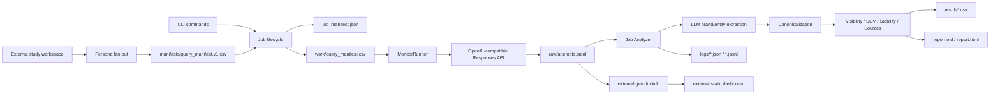
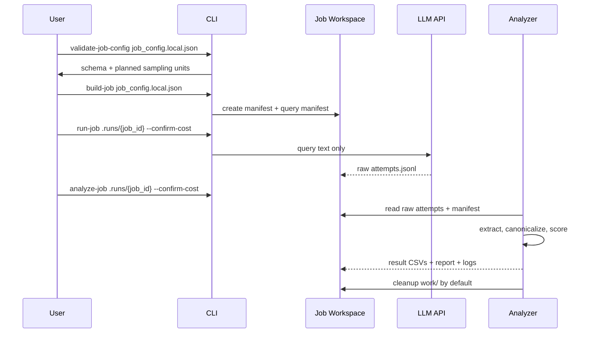
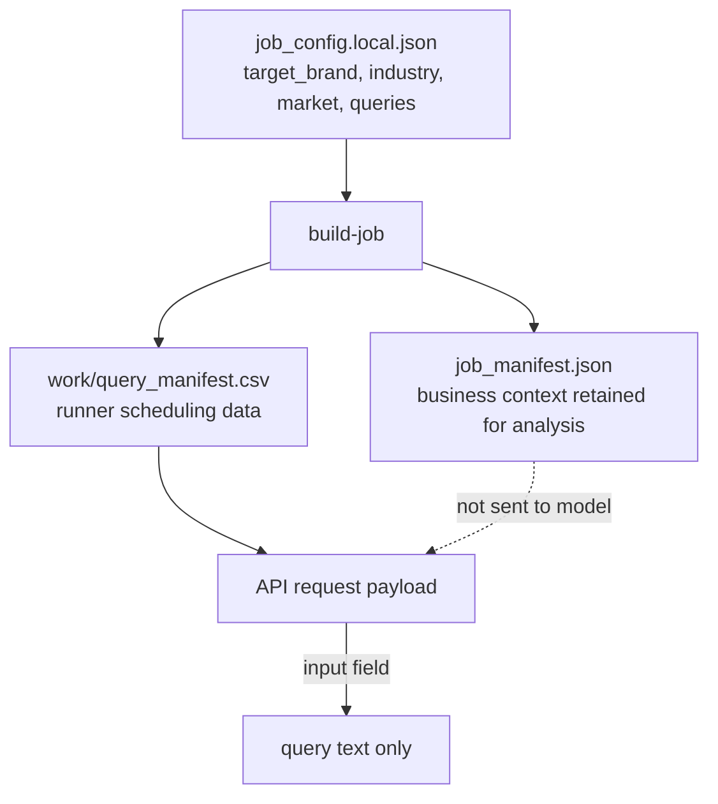
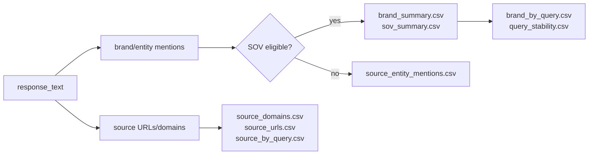

# GEO Brand Monitor

GEO Brand Monitor is a job-based CLI for measuring how brands appear in LLM answers.
It sends only user-like query text to an OpenAI-compatible Responses API, keeps raw
answer audit logs, extracts brand/entity mentions from the returned text, and produces
brand visibility, SOV, source, and stability reports.

It is a lightweight GEO analysis engine, not a GEO SaaS product. The repository and
package contain engine code only. Business query data, brand data, frozen manifests,
long-running study history, DuckDB files, and dashboards should live in a user-owned
external study workspace.

The project is intentionally neutral:

- no bundled brand, industry, or query sample data;
- no provider-specific client naming or default model binding;
- no prebuilt competitor alias list;
- task data lives in local runtime bundles, not in repository source files.

## Study Workspace Model

Use three separate layers:

```text
geo-monitor project
  engine / CLI / package / skill code

job workspace
  one execution bundle under a runs directory
  work/query_manifest.csv is temporary runner input
  raw/, logs/, result/, job_manifest.json are audit artifacts

study workspace
  seed_prompts.yaml
  manifests/query_manifest.v1.csv
  runs/{job_id}/...
  geo.duckdb
  dashboard/
```

`work/query_manifest.csv` remains a working file and may be deleted by cleanup. Long-term
analysis is reconstructed from `raw/attempts.jsonl`, where each new attempt includes the
actual `query` and a `query_meta` snapshot with dimensions such as `seed_id`, `persona`,
and `variant_id`.

## What It Measures

- Brand visibility across repeated LLM answers.
- Share of Voice (SOV) by response-level and mention-event-level signals.
- Recommended/ranked/sentiment signals when the answer structure exposes them.
- Query-level brand set stability across repeated samples.
- Source URL/domain co-occurrence returned by the model response.
- Data quality issues such as bad raw lines, partial samples, duplicated units, or
  job contract mismatches.

It does **not** claim market share, factual correctness, or native app ranking. It is an
API-based monitoring and audit framework.

## Architecture



## Job Lifecycle



## Data Contract

The task config stores business context. The runtime prompt does not.



The live request payload is deliberately narrow:

```json
{
  "model": "<MODEL_OR_ENDPOINT_ID>",
  "input": "<QUERY_TEXT>",
  "tools": [{"type": "web_search", "limit": 5}],
  "max_tool_calls": 2
}
```

It does not include `target_brand`, `industry`, `market`, or competitor names.

## Repository Layout

```text
src/geo_monitor/
  cli.py                 # public CLI commands
  config.py              # runtime settings and workspace root
  llm_client.py          # OpenAI-compatible Responses API client
  job.py                 # build/run/cleanup job lifecycle
  runner.py              # repeated sampling, resume, concurrency
  job_analysis.py        # extraction, metrics, reports, aggregates
  brand_extraction.py    # LLM extraction schema and canonicalization helpers
  response_parser.py     # response text/source parsing
  exporters.py           # JSONL/CSV utilities
  reporting.py           # Markdown/HTML/PDF helpers

data/
  job_config.schema.json # public config contract only

tests/
  fixtures/              # neutral test fixtures
```

## Runtime Workspace

Each run creates a local job bundle:

```text
.runs/{job_id}/
  job_manifest.json
  work/
    query_manifest.csv
    brand_mentions_raw.jsonl
    brand_canonical_map_work.json
  raw/
    attempts.jsonl
  logs/
    run_summary.json
    analysis_summary.json
    data_quality.json
    extraction_errors.jsonl
    raw_read_errors.jsonl
    cleanup_summary.json
  result/
    discovered_brands.csv
    brand_mentions_extracted.csv
    brand_canonical_map.csv
    brand_summary.csv
    sov_summary.csv
    brand_by_query.csv
    query_stability.csv
    source_entity_mentions.csv
    source_domains.csv
    source_urls.csv
    source_by_query.csv
    report.md
    report.html
```

`work/` is temporary and is cleaned after analysis unless `--keep-work` is passed.
`raw/`, `logs/`, `result/`, and `job_manifest.json` are retained for audit.

## Metric Model



Important definitions:

- **Mention rate**: responses mentioning a brand / successful responses.
- **SOV response share**: responses mentioning a brand / all brand response hits.
- **SOV event share**: eligible brand mention events / all eligible brand mention events.
- **Query coverage**: queries where a brand appeared / planned query count.
- **Stability**: repeated-answer similarity for brand sets and source-domain sets.

## Quick Start

```bash
python3 -m venv .venv
source .venv/bin/activate
pip install -e ".[dev]"
cp .env.example .env
```

Fill `.env` with your provider credentials:

```bash
LLM_API_KEY=
LLM_BASE_URL=https://api.example.com/v1
LLM_MODEL=provider-model
WEB_SEARCH_LIMIT=5
MAX_TOOL_CALLS=2
REQUEST_TIMEOUT_SECONDS=90
RETRY_MAX_ATTEMPTS=3
CONCURRENCY=1
```

Create a local config file such as `job_config.local.json`:

```json
{
  "target_brand": "<TARGET_BRAND>",
  "target_aliases": ["<OPTIONAL_TARGET_ALIAS>"],
  "industry": "<INDUSTRY>",
  "market": "<OPTIONAL_MARKET>",
  "queries": ["<QUERY_TEXT>"],
  "repeats": 20,
  "model": "<MODEL_OR_ENDPOINT_ID>",
  "web_search_limit": 5,
  "concurrency": 4,
  "start_interval_seconds": 0
}
```

Recommended external study workspace lifecycle:

```bash
STUDY_DIR=./my-geo-study
mkdir -p "$STUDY_DIR/manifests" "$STUDY_DIR/runs"

geo-monitor fanout \
  --input "$STUDY_DIR/seed_prompts.yaml" \
  --output "$STUDY_DIR/manifests/query_manifest.v1.csv"

geo-monitor build-job job_config.local.json \
  --query-manifest "$STUDY_DIR/manifests/query_manifest.v1.csv" \
  --runs-dir "$STUDY_DIR/runs"
```

Run a generated job:

```bash
geo-monitor validate-job-config job_config.local.json \
  --query-manifest "$STUDY_DIR/manifests/query_manifest.v1.csv"
geo-monitor run-job "$STUDY_DIR/runs/{job_id}" --confirm-cost
geo-monitor analyze-job "$STUDY_DIR/runs/{job_id}" --confirm-cost
```

`validate-job-config` validates inline config queries by default. When using an
external query manifest, pass `--query-manifest` so validation also checks the
frozen manifest and reports the external query count.

The repository `.gitignore` excludes common local study workspace outputs such
as `my-geo-study/` and `*.duckdb`, but study data should still be treated as
user-owned execution data rather than source code.

Use mock mode for a no-cost pipeline smoke test:

```bash
geo-monitor run-job .runs/{job_id} --mock
geo-monitor analyze-job .runs/{job_id} --include-mock
```

## Persona Fan-out

Example `seed_prompts.yaml`:

```yaml
seeds:
  - seed_id: sample_beginner
    category: sample_category
    intent: product_recommendation
    seed_query: "推荐一款适合新手的示例产品"
    personas:
      - budget_sensitive
      - quality_oriented
      - comparison_shopper
      - beginner
      - convenience_first
```

Build a frozen external manifest:

```bash
geo-monitor fanout \
  --input ./my-geo-study/seed_prompts.yaml \
  --output ./my-geo-study/manifests/query_manifest.v1.csv
```

Fan-out output is deterministic and uses fixed columns: `query_id`, `variant_id`,
`seed_id`, `seed_query`, `category`, `intent`, `persona`, `template_id`, `query`,
`language`, `generation_method`, `fanout_version`, `manifest_version`, `locked_at`.

## DuckDB And Dashboard

Build the external analysis cache:

```bash
geo-monitor db build --runs ./my-geo-study/runs --output ./my-geo-study/geo.duckdb
geo-monitor db inspect --db ./my-geo-study/geo.duckdb
geo-monitor db query --db ./my-geo-study/geo.duckdb \
  "select seed_id, persona, count(*) from queries group by 1,2"
```

Build a static dashboard:

```bash
geo-monitor dashboard build \
  --db ./my-geo-study/geo.duckdb \
  --out ./my-geo-study/dashboard
```

DuckDB is a rebuildable analysis cache. It does not replace raw JSONL. It reads query
dimensions from raw attempt `query_meta` and does not require `work/query_manifest.csv`.

## Plugin / Skill API

```python
from geo_monitor.tool import run_geo_monitor

result = run_geo_monitor(
    config_path="job_config.local.json",
    study_dir="./my-geo-study",
    query_manifest_path="./my-geo-study/manifests/query_manifest.v1.csv",
    mock=True,
    build_db=True,
    build_dashboard=False,
)

print(result.summary_markdown)
print(result.metrics)
```

High-level API calls require either `study_dir` or `runs_dir`. `query_manifest_path` is
explicit and is never guessed from a study directory.

## Public CLI Surface

```text
doctor
validate-job-config
fanout
build-job
run-job
analyze-job
cleanup-job
export-csv
db build / db inspect / db query
dashboard build
```

Cost-producing live calls require explicit `--confirm-cost`.

## Design Decisions

- **Job bundles over fixed project data**: real task inputs and generated artifacts stay
  in `.runs/{job_id}` or ignored local files.
- **Human-like prompt boundary**: the model receives only the query text.
- **Open discovery over competitor lists**: brands are extracted from raw answers, so new
  industries do not need prebuilt competitor aliases.
- **Hash-based resume**: completed samples are reused only when request parameters match.
- **Audit-first output**: raw attempts, quality logs, CSVs, and reports are all retained.
- **Provider-neutral API layer**: the client targets OpenAI-compatible Responses APIs.

## Development

```bash
python -m pytest
```

The repository intentionally excludes `.env`, `.runs/`, `.venv/`, cache directories, and
local task data.
