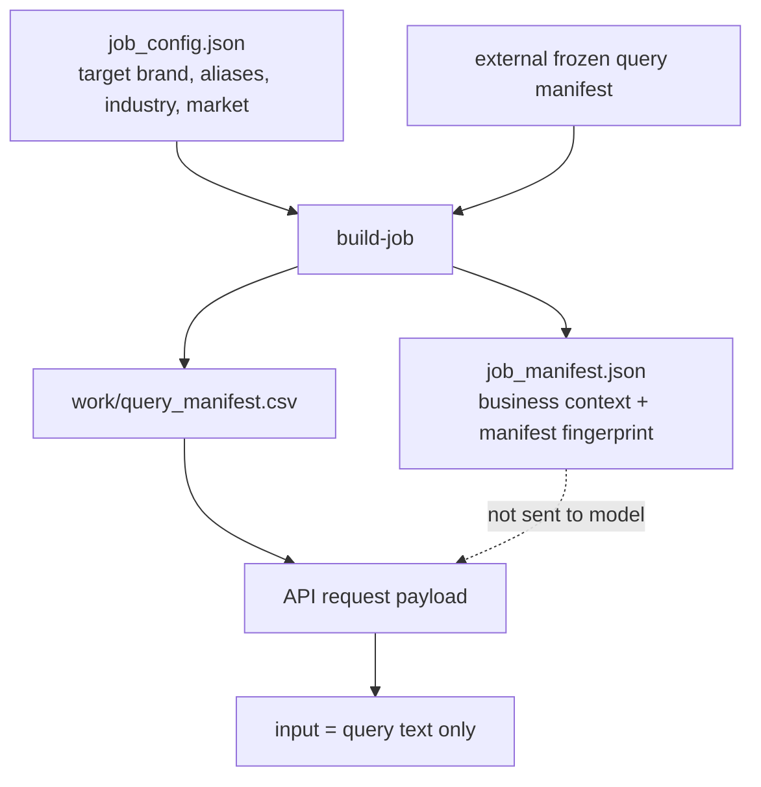
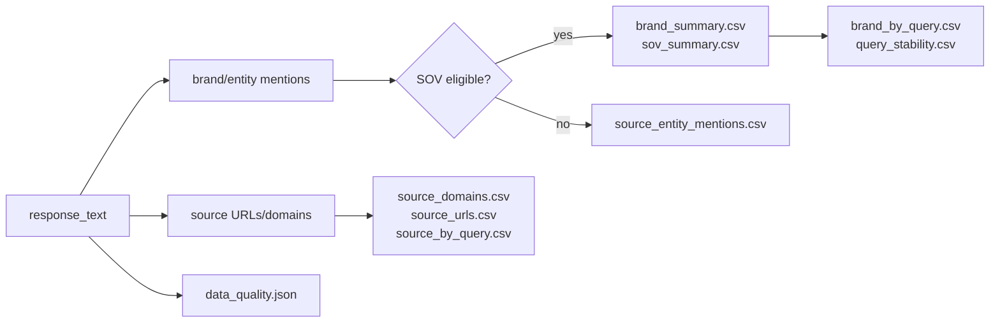

# GEO Brand Monitor

[English](README.md) | 简体中文

GEO Brand Monitor 是一个轻量、可审计、CLI-first 的 GEO Analysis Engine，用于采样
LLM 回答、分析品牌可见性，并生成可复现的本地报告。

它的定位是 engine、CLI、Python package，以及可嵌入到 Agent / Skill / Tool
工作流中的能力模块。它不是 GEO SaaS，不是调度系统，也不是数据仓库。仓库只保存
可复用的引擎代码；业务 query、品牌数据、raw runs、DuckDB 文件和 dashboard 都应放在
用户自己的 external study workspace 中。

## 项目状态

当前核心本地流程已经可用：

- persona fan-out 生成 frozen query manifest；
- job-based sampling 和 raw JSONL audit log；
- 品牌 / 实体抽取与 canonicalization；
- visibility、SOV、recommendation、rank、sentiment、source、stability CSV；
- 可重建的 DuckDB analysis cache；
- 本地静态 dashboard；
- 面向 Plugin / Skill / Agent workflow 的 Python API。

项目采用 MIT License。见 [LICENSE](LICENSE)。

## 这个项目解决什么问题

GEO Brand Monitor 用来回答：

- 目标品牌是否出现在 AI 回答中？
- 在重复采样中出现频率如何？
- 哪些其他品牌或实体和它一起出现？
- 它只是被提及，还是被推荐、排序、正向描述？
- 哪些 query、persona、source domain 推动了结果？
- 样本是否完整、质量是否足够可信？

它不声称衡量市场份额、事实正确性、原生 App 排名或 SEO 效果。它衡量的是在受控 query
manifest 下，OpenAI-compatible Responses API 返回的回答样本。

## 核心功能

- **CLI-first 工作流**：本地完成 build、run、analyze、export、query、dashboard。
- **External study workspace**：长期监测数据不放进项目仓库。
- **Persona fan-out**：把 seed prompts 变成 deterministic persona query variants。
- **Frozen query manifest**：稳定输入，保证重复运行可复现。
- **Job workspace**：每次运行都是一个可审计的 execution bundle。
- **Raw audit logs**：每条 attempt 都以 JSONL 保存，并包含 `query` 和 `query_meta`。
- **Brand extraction**：从回答中发现品牌 / 实体，不依赖内置竞品列表。
- **Metrics and reports**：输出 CSV、Markdown、HTML，以及 best-effort 可选 PDF。
- **DuckDB analysis layer**：本地可重建的跨 run 分析缓存。
- **Static dashboard**：无后端服务的本地静态 HTML dashboard。
- **Python API**：返回结构化结果，方便外部 Agent / workflow 调用。

## 架构

```mermaid
flowchart LR
    Study["External study workspace"] --> Seeds["seed_prompts.yaml"]
    Seeds --> Fanout["Persona fan-out"]
    Fanout --> Frozen["manifests/query_manifest.v1.csv"]

    Config["job_config.json"] --> Build["build-job"]
    Frozen --> Build
    Build --> Job["job workspace<br/>runs/{job_id}"]
    Job --> Work["work/query_manifest.csv<br/>temporary runner input"]

    Work --> Runner["sampling runner"]
    Runner --> API["OpenAI-compatible<br/>Responses API"]
    API --> Raw["raw/attempts.jsonl<br/>query + query_meta snapshot"]

    Raw --> Analyze["analyze-job"]
    Analyze --> Extract["brand/entity extraction"]
    Extract --> Metrics["visibility / SOV / sources / quality"]
    Metrics --> CSV["result/*.csv"]
    Metrics --> Report["report.md / report.html"]
    Metrics --> Logs["logs/*.json / *.jsonl"]

    Raw --> DuckDB["geo.duckdb<br/>external analysis cache"]
    CSV --> DuckDB
    DuckDB --> Dashboard["static dashboard"]
    DuckDB --> API2["Python API / agent tools"]
```



## Workspace 模型

项目刻意把 engine、单次执行产物、长期 study 数据分开：

```text
geo-monitor project
  engine / CLI / package / skill code
  不保存业务数据或长期 study 状态

job workspace
  runs 目录下的一次执行 bundle
  work/query_manifest.csv 是临时 runner 输入
  raw/、logs/、result/、job_manifest.json 是保留的审计产物

study workspace
  seed_prompts.yaml
  manifests/query_manifest.v1.csv
  runs/{job_id}/...
  geo.duckdb
  dashboard/
```

`work/query_manifest.csv` 可以在运行后删除。长期分析依赖 `raw/attempts.jsonl`，每条新
attempt 都包含实际发送给模型的 query text，以及 `query_meta` snapshot，例如
`seed_id`、`persona`、`intent`、`template_id`、`variant_id`、`locked_at`，以及
保存在 `query_metadata_json` 中的自定义 manifest metadata。

真实长期 study 建议放在仓库外部目录。仓库 `.gitignore` 也会忽略常见本地 study 输出，
例如 `my-geo-study/`、`study/`、`*.duckdb`。

## 数据边界

模型只接收用户式 query text。任务级业务上下文只用于本地分析，不发送给模型。



真实请求结构类似：

```json
{
  "model": "<MODEL_OR_ENDPOINT_ID>",
  "input": "<QUERY_TEXT>",
  "tools": [{"type": "web_search", "limit": 5}],
  "max_tool_calls": 2
}
```

请求中不会包含 `target_brand`、`industry`、`market` 或 competitor names。

`raw/attempts.jsonl` 是敏感的本地审计数据，可能包含原始模型输出、citation snippet、
source URL、provider metadata、业务 query text，以及 query/response 中出现的品牌或项目上下文。
长期 study workspace 应放在用户可控目录，并设置合适的文件权限；共享 job bundle 前可能需要脱敏。
项目仍默认保留 raw attempts，以保证 audit-first 和可复现。

## 快速开始：本地 Mock Run

下面这条 smoke test 不调用外部 API。

```bash
python3 -m venv .venv
source .venv/bin/activate
pip install -e ".[dev]"

STUDY_DIR=/tmp/geo-monitor-study
RUNS_DIR="$STUDY_DIR/runs"
MANIFEST="$STUDY_DIR/manifests/query_manifest.v1.csv"
DB="$STUDY_DIR/geo.duckdb"
DASHBOARD="$STUDY_DIR/dashboard"

mkdir -p "$STUDY_DIR/manifests" "$RUNS_DIR"

geo-monitor fanout \
  --input examples/seed_prompts.example.yaml \
  --output "$MANIFEST"

geo-monitor validate-job-config examples/job_config.example.json \
  --query-manifest "$MANIFEST"

geo-monitor build-job examples/job_config.example.json \
  --query-manifest "$MANIFEST" \
  --runs-dir "$RUNS_DIR"

JOB_DIR=$(find "$RUNS_DIR" -maxdepth 1 -mindepth 1 -type d | head -n 1)

geo-monitor run-job "$JOB_DIR" --mock
geo-monitor analyze-job "$JOB_DIR" --include-mock

geo-monitor db build --runs "$RUNS_DIR" --output "$DB"
geo-monitor dashboard build --db "$DB" --out "$DASHBOARD"
```

打开本地 dashboard：

```text
/tmp/geo-monitor-study/dashboard/index.html
```

## 真实 API 配置

通过环境变量配置 OpenAI-compatible Responses API provider；如果要使用 env file，需要显式
指定。CLI 默认不再信任当前工作目录中的 `.env`。

```bash
cp .env.example /tmp/geo-monitor.env
export GEO_MONITOR_ENV_FILE=/tmp/geo-monitor.env
```

```bash
LLM_API_KEY=
LLM_BASE_URL=https://api.example.com/v1
LLM_MODEL=provider-model
WEB_SEARCH_LIMIT=5
MAX_TOOL_CALLS=2
REQUEST_TIMEOUT_SECONDS=90
RETRY_MAX_ATTEMPTS=3
CONCURRENCY=1
```

`https://api.example.com/v1` 是示例 endpoint。只有 `LLM_BASE_URL` 指向真实 `http(s)`
endpoint 且 `LLM_API_KEY` 已配置时，live 命令才会继续执行。可以用 `geo-monitor doctor`
查看当前 endpoint、API key 状态和 env file 来源。

真实采样和真实 LLM extraction 可能产生 provider 成本。会产生 live 成本的命令需要显式
传入 `--confirm-cost`。

```bash
geo-monitor run-job "$JOB_DIR" --confirm-cost
geo-monitor analyze-job "$JOB_DIR" --confirm-cost
```

## Persona Fan-out

Seed prompts 表示稳定的业务意图。Fan-out 会根据 persona 生成 deterministic query variants。

```yaml
seeds:
  - seed_id: sample_beginner
    category: sample_category
    intent: product_recommendation
    seed_query: "推荐一款适合新手的示例产品"
    language: zh-CN
    personas:
      - budget_sensitive
      - quality_oriented
      - comparison_shopper
      - beginner
      - convenience_first
```

生成 external frozen manifest：

```bash
geo-monitor fanout \
  --input ./study/seed_prompts.yaml \
  --output ./study/manifests/query_manifest.v1.csv
```

相同输入和版本下，fan-out 输出 byte-stable。固定 CSV 字段如下：

```text
query_id, variant_id, seed_id, seed_query, category, intent, persona,
template_id, query, language, generation_method, fanout_version,
manifest_version, locked_at
```

## 输出产物

每个 job workspace 结构如下：

```text
runs/{job_id}/
  job_manifest.json
  work/
    query_manifest.csv
    brand_mentions_raw.jsonl
    brand_canonical_map_work.json
  raw/
    attempts.jsonl
  logs/
    run_summary.json
    analysis_summary.json
    data_quality.json
    extraction_errors.jsonl
    raw_read_errors.jsonl
    cleanup_summary.json
  result/
    discovered_brands.csv
    brand_mentions_extracted.csv
    brand_canonical_map.csv
    brand_summary.csv
    sov_summary.csv
    brand_by_query.csv
    query_stability.csv
    source_entity_mentions.csv
    source_domains.csv
    source_urls.csv
    source_by_query.csv
    report.md
    report.html
    report.pdf              # optional, best-effort
```

`work/` 是临时目录。`raw/`、`logs/`、`result/` 和 `job_manifest.json` 会保留，用于审计。
`analyze-job` 默认会在分析后删除 `work/`；调试中间抽取文件时可使用 `--keep-work`。

分析更新 study-level aggregate 时，runs 目录还会包含：

```text
runs/index.jsonl
runs/aggregate/brand_trends.csv
runs/aggregate/target_brand_trends.csv
```

这些文件是紧凑的跨 run study summary，适合作为长期 study 状态；同时也可从保留的 job bundle
重建。嵌入式或单 bundle 工作流可以使用 `analyze-job --no-aggregate` 或
`run_geo_monitor(..., write_aggregates=False)`。

## 指标模型



详细分母、粒度、mock/live 规则、partial sample caveat，以及当前 SOV 字段重合说明，见
[docs/metrics.md](docs/metrics.md)。

当前核心指标包括：

- **Mention rate**：提及某品牌的回答数 / 成功回答数。
- **SOV response share**：提及某品牌的回答数 / 所有品牌回答命中数。
- **SOV event share**：eligible brand mention events / 全部 eligible events。
- **Query coverage**：品牌出现过的 query 数 / planned query 数。
- **Recommendation rates**：推荐信号在提及样本和全样本中的比例。
- **Rank signals**：排名观测率、平均排名、Top 3 presence。
- **Sentiment signals**：positive、neutral、negative、unknown rate。
- **Stability**：重复回答中的品牌集合相似度。
- **Source coverage**：source domain 和 URL 的出现与覆盖。
- **Data quality**：partial sample、bad raw lines、duplicate units、contract mismatch、extraction error。

## DuckDB 和 Dashboard

DuckDB 是可重建的本地分析缓存，不替代 raw JSONL。

```bash
geo-monitor db build --runs ./study/runs --output ./study/geo.duckdb
geo-monitor db inspect --db ./study/geo.duckdb
geo-monitor db query --db ./study/geo.duckdb \
  "select seed_id, persona, count(*) from queries group by 1,2"
```

`db query` 是受限的本地只读分析辅助命令。它会拒绝多语句 SQL、写入/admin 语句，以及 DuckDB
外部文件读取函数。高级 admin SQL 应由可信操作者使用 DuckDB 官方工具执行。Agent-facing 或嵌入式
工作流应优先使用结构化 Python API 结果，而不是暴露原始 SQL。

生成静态 dashboard：

```bash
geo-monitor dashboard build \
  --db ./study/geo.duckdb \
  --out ./study/dashboard
```

Dashboard 是静态 HTML，不需要后端服务、登录、React/Vue 应用或远程数据库。

## Python API

```python
from geo_monitor import run_geo_monitor

result = run_geo_monitor(
    config_path="examples/job_config.example.json",
    study_dir="./study",
    query_manifest_path="./study/manifests/query_manifest.v1.csv",
    mock=True,
    build_db=True,
    build_dashboard=False,
)

print(result.summary_markdown)
print(result.metrics)
print(result.artifact_paths)
```

高层 API 需要显式传入 `study_dir` 或 `runs_dir`。显式路径优先。`query_manifest_path`
不会从 study directory 自动猜测。`geo_monitor.api` 是 canonical implementation module；
`geo_monitor` 会为了方便进行 re-export。`geo_monitor.tool` 只保留为向后兼容 import shim。

安装后的 wheel 会在 `geo_monitor/data`、`geo_monitor/examples`、`geo_monitor/docs` 下包含
job config schema、examples、metrics reference 和简体中文 README。源码 checkout 仍可继续使用
上文展示的顶层 `data/`、`examples/` 和 `docs/` 路径。

## CLI 命令

```text
doctor
validate-job-config
fanout
build-job
run-job
analyze-job
cleanup-job
export-csv
db build / db inspect / db query
dashboard build
```

## 仓库结构

```text
src/geo_monitor/
  cli.py                 # public CLI commands
  config.py              # runtime settings and workspace root
  dataset.py             # query manifest loading
  fanout.py              # seed prompt -> persona query manifest
  job.py                 # build/run/cleanup job lifecycle
  runner.py              # repeated sampling, resume, concurrency
  analysis/              # extraction pipeline, metrics, reports, aggregates
  job_analysis.py        # compatibility facade for analysis imports
  brand_extraction.py    # LLM extraction schema and canonicalization
  response_parser.py     # response text/source parsing
  exporters.py           # JSONL/CSV utilities
  reporting.py           # Markdown/HTML/PDF helpers
  db.py                  # DuckDB analysis cache
  dashboard.py           # static HTML dashboard
  api.py                 # stable public Python API implementation
  tool.py                # backward-compatible API import shim

data/
  job_config.schema.json

examples/
  job_config.example.json
  seed_prompts.example.yaml

tests/
  fixtures/
```

## 设计原则

- **Lightweight**：本地文件、CLI 命令、小模块。
- **Audit-first**：raw attempts 和 quality logs 是事实源。
- **Engine-first**：不做用户系统、SaaS dashboard 或调度系统。
- **Provider-neutral**：面向 OpenAI-compatible Responses APIs。
- **Study workspace boundary**：长期业务数据不进入项目仓库。
- **Human-like prompt boundary**：模型只收到 query text。
- **Open discovery**：竞品从回答中发现，而不是来自内置 alias list。

## 开发

```bash
python -m pytest
```

仓库默认排除 `.env`、`.runs/`、`.venv/`、local study workspace、DuckDB 文件、缓存目录和生成的任务数据。

## License

MIT。见 [LICENSE](LICENSE)。
